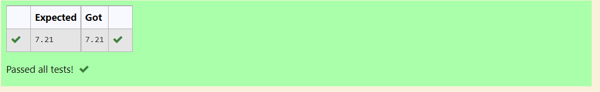

# DISTANCE-BETWEEN-TWO-POINTS

## AIM:
To write a python program to find the distance two 2 points
## ALGORITHM:
### Step 1: 
### Step 2: 
### Step 3: 
Substitute the values in the distance formula  
### Step 4: 
### Step 5: 
### PROGRAM:
```python
#Program to find the distance between two points.
#Developed by: 
#RegisterNumber:
import math
p1=[4,2]
p2=[10,6]
x=p2[0]-p1[0]
y=p2[1]-p1[1]
d=math.sqrt(x**2 + y**2)
print("{:.2f}".format(d))
```

### OUTPUT:

### RESULT:

