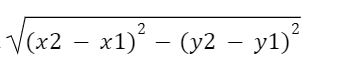

# DISTANCE-BETWEEN-TWO-POINTS

## AIM:
To write a python program to find the distance two 2 points
## ALGORITHM:
### Step 1:
Define two variables with coordinate of two points in a list 
### Step 2: 
Subtract the elements in the corresponding indices of the two lists.
### Step 3: 
Substitute the values in the distance formula  
### Step 4:
Print the value
### Step 5: 
End the program
### PROGRAM:
```python
#Program to find the distance between two points.
#Developed by:A.J.PRANAV
#RegisterNumber:22008772
import math
p1=[4,2]
p2=[10,6]
x=p2[0]-p1[0]
y=p2[1]-p1[1]
d=math.sqrt(x**2 + y**2)
print("{:.2f}".format(d))
```

### OUTPUT:

### RESULT:
Thus the program for calculating the distance between the two points is successfully executed.
